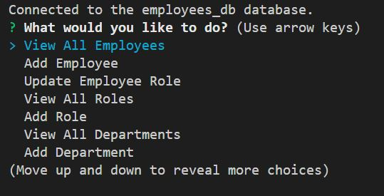
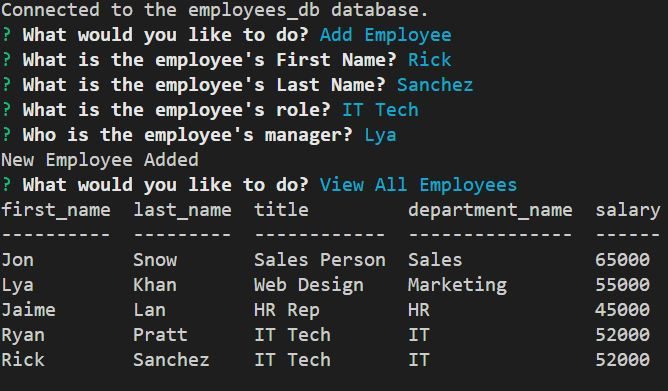
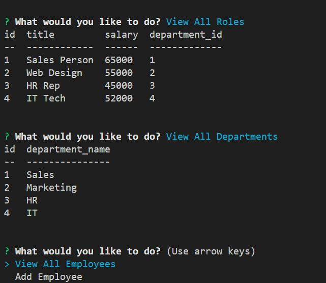

# Employee Tracker 2/23/2023

## Description

This project is an application that stores data in a databases from user inputs and displays back to the user new and existing data from the database in table form.

## Table of Contents

[Badges](#badges)

[Visuals](#visuals)

[Installation](#installation)

[Usage](#usage)

[Support](#support)

[Contribution](#contribution)

[Authors](#authors)

[License](#license)

<a name="badges"/>

## Badges

N/A

<a name="visuals"/>

## Visuals

A video demo of the application can be found on the following link [here.](https://drive.google.com/file/d/1juA3aD5MedVRveKHThEQXrZyq5EPh0Dy/view)

<a name="installation"/>

## Installation

This project can be cloned from my GitHub repo link found at the bottom of this project's README file. Once installed node, package.json files, and inquirer, mysql2 and cTable are required to be installed to be able to run this application locally.

Once cloned a command of node install can be run in the terminal to install the necessary dependencies of this project.

<a name="usage"/>

## Usage

This project could be used to store, update, and display employee information for a small business or office. The application takes user input via inquirer and command prompts. Using the user inputs mySQL data is generated and stored in the corresponding database and tables. The database is then queryed again to get the necessary data that will be displayed by cTable (console.table) in the console.

<a name="support"/>

## Support

N/A

<a name="contribution"/>

## Contributing

The GitHub Repository can be found on the following this link [here.](https://github.com/aguilarj5/Employee-Tracker.git)

<a name="authors"/>

## Authors and acknowledgment

GitHub: aguilarj5

Inquirer Documentation link: https://www.npmjs.com/package/inquirer

mySQL2 Documentaion link: https://www.npmjs.com/package/mysql2#first-query

Console Table Documentation: https://www.npmjs.com/package/console.table

<a name="license"/>

## License

N/A
